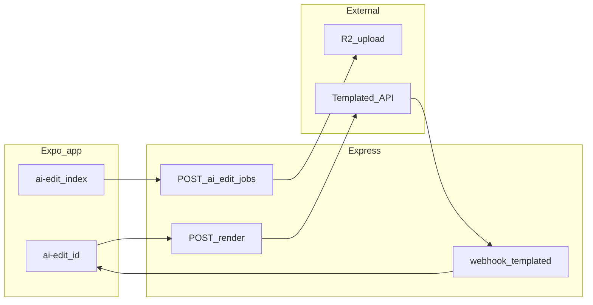

# RawStock：プロジェクト全容と必要タスクのまとめ

## 前置き：これは何のプロジェクトか

**RawStock** は、アンダーグラウンド音楽向けのマーケットプレイス／コミュニティアプリです。ライブ映像の販売、クリエイターへの高い還元（README では 90% クリエイター側のイメージ）、コミュニティ主導の発見、編集者とのつながり、チケット・Stripe（JPY）決済などを扱います。Buildathon 文脈では **AI Edit アシスタント**（自然言語 → 編集ジョブ → レビュー）が差別化軸になっています。

思想・ユーザーストーリーの詳細は [README.md](README.md) にまとまっています（ここでは技術とタスクに寄せます）。

---

## 技術スタックとリポジトリの形

| 層 | 内容 |
|----|------|
| クライアント | **Expo 55** + **expo-router**、React 19 / RN Web。画面は [app/](app/) 配下のファイルベースルーティング（66+ の `*.tsx`） |
| API | **Express 5**（[`server/index.ts`](server/index.ts) で起動、[`server/routes.ts`](server/routes.ts) にルート集約） |
| DB | **PostgreSQL** + **Drizzle ORM**（[`server/schema.ts`](server/schema.ts)、[`migrations/*.sql`](migrations/) は `0000`〜`0006`） |
| ストレージ / 外部 | Cloudflare **R2**（アップロード）、**Templated** レンダー、Stripe、認証（Google 等）、Upstash Redis など |
| 共有型 | [`shared/`](shared/)（例: RawStock の動画仕様 DSL） |

**本番のざっくり流れ**: Expo の静的エクスポート（`expo export` / `build:full`）とサーバーバンドル（`esbuild` → `server_dist`）を組み合わせ、同一 Express が API と静的配信を担う構成（[`server/index.ts`](server/index.ts) の manifest / landing / proxy まわり）。

**補足**: [`vite-app/`](vite-app/) は別フロントの名残・実験用の可能性があり、Expo の [`app/`](app/) と導線が二重にならないよう注意が必要です。[`dist/`](dist/) はビルド成果物がコミットされていると、デプロイや「古い画面」認識と混線しやすいです。

---

## プロダクト上の主要ドメイン（画面の地図）

[`app/`](app/) から読み取れる機能ブロックの例：

- **認証**: [`app/auth/`](app/auth/)
- **ホーム・タブ**: [`app/(tabs)/`](app/(tabs)/)（index / community / live / dm / profile）
- **動画**: アップロード [`app/upload/`](app/upload/)、詳細 [`app/video/[id].tsx`](app/video/[id].tsx)
- **コミュニティ**: [`app/community/`](app/community/)（作成、ジャンル、広告申請、管理者）
- **ライブ・配信**: [`app/live/`](app/live/)、[`app/broadcast.tsx`](app/broadcast.tsx)
- **メンター（旧 twoshot 系）**: `mentor-*`、`mentor-book` など
- **チケット・収益**: [`app/tickets.tsx`](app/tickets.tsx)、[`app/revenue.tsx`](app/revenue.tsx)
- **編集者・依頼**: [`app/editors.tsx`](app/editors.tsx)、[`app/editing-request.tsx`](app/editing-request.tsx)、[`app/editor-profile.tsx`](app/editor-profile.tsx)（登録・プロフィールはトップの「Hire」とは別概念）
- **AI Edit**: [`app/ai-edit/index.tsx`](app/ai-edit/index.tsx)、[`app/ai-edit/[id].tsx`](app/ai-edit/[id].tsx)
- **管理**: [`app/admin/`](app/admin/)
- **その他**: DM、通知、リバー一覧、コンサート、ジュークボックス、設定など

サーバー側は [`server/routes.ts`](server/routes.ts) に API が密集しており、スキーマは [`server/schema.ts`](server/schema.ts) が真実の源泉です。

---

## AI Edit パイプライン（要点）

README のフローに沿った実装の核：

1. R2 へのアップロード（署名 URL 等）
2. `POST /api/ai-edit/jobs` — プロンプト・チケット・**`video_spec`（DSL）** などを保存（検証は [`server/lib/parseVideoSpec.ts`](server/lib/parseVideoSpec.ts) 等）
3. Templated 向け変換 [`server/lib/dslToTemplated.ts`](server/lib/dslToTemplated.ts)、クライアント [`server/lib/templatedClient.ts`](server/lib/templatedClient.ts)
4. `POST /api/ai-edit/jobs/:id/render` — レンダー開始、webhook で完了処理（環境変数は [`.env.example`](.env.example) 参照）
5. ジョブ詳細 UI で approve / revise など

DSL の型は [`shared/rawstock-video-spec.ts`](shared/rawstock-video-spec.ts) に置くのが意図です。

---

## 「必要タスク」として整理しておくべきこと

### 1. 品質の土台（バグ潰しの前提）

- **`tsc --noEmit`**（[`tsconfig.json`](tsconfig.json) は `strict: true`）をローカル／CI で常に通す
- **`npm run lint`**（`expo lint`）を同様に
- **`npm run build:full`** または本番と同じビルド手順の自動化
- **自動テストは現状ほぼ無い**（`*.test.ts` 等なし）— 壊れやすい層（`parseVideoSpec`、金額・チケット、webhook パース）から少しずつ追加する価値あり

### 2. 既知の導線・仕様の不整合（ユーザー体験バグの温床）

| 事象 | ファイルの目安 |
|------|----------------|
| [`app/editors.tsx`](app/editors.tsx) が `/editing-request?editorId=...` 等で遷移するが、[`app/editing-request.tsx`](app/editing-request.tsx) がクエリを読んでいない | クエリをフォーム表示・API に反映するか、URL をやめるか方針決定 |
| 編集依頼が **二系統**（例: `POST /api/editing-requests` と `POST /api/editors/:id/request`、テーブルも別） | どちらを正とするか、または UI を用途別に明示して混線を防ぐ |
| [`app/editor-profile.tsx`](app/editor-profile.tsx) に通常ナビからのリンクが無い可能性 | プロフィールや「エディター登録後」の導線を追加 |
| `POST .../ai-edit/jobs/:id/render` が **フロントから未呼び出し** | [`app/ai-edit/[id].tsx`](app/ai-edit/[id].tsx) 等に「レンダー開始」ボタンと状態表示 |

### 3. インフラ・運用

- **本番 DB** に [`migrations/`](migrations/) の未適用マイグレーションがないか（`video_spec`、`templated_render_id` など）
- **Templated webhook** の実ペイロードと [`server/routes.ts`](server/routes.ts) の解釈の一致確認
- **`dist/` と静的ビルド出力先**（README／デプロイ手順と実際の `static-build` 等）の一本化

### 4. リポジトリの重複リスク

- [`vite-app/`](vite-app/) と Expo [`app/`](app/) の役割分担を文書化するか、不要なら整理
- コミット済み **`dist/`** の扱い（`.gitignore` とデプロイパイプラインの整合）

---

## このドキュメントの使い方

- **「全容」**として: スタック・画面の地図・AI Edit のデータの流れをここを起点に参照する
- **「必要タスク」**として: 上記セクション 1〜4 をバックログに落とし、優先度（本番障害 / 課金 / 主要フロー）で順に潰す

個別の実装（例: クエリ連携、`/render` ボタン追加）は、このプラン承認後にチケット単位で着手するのがよいです。
